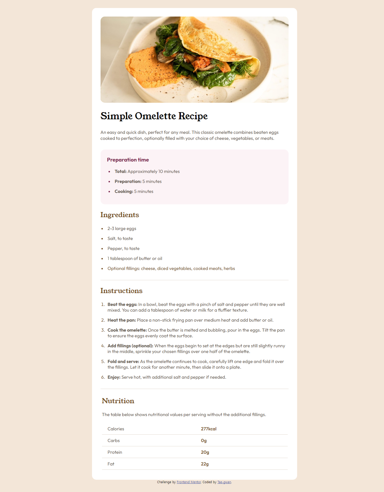

# 1.Recipe-page
My first practicing of HTML&amp;CSS!

# Frontend Mentor - Recipe page solution

This is a solution to the [Recipe page challenge on Frontend Mentor](https://www.frontendmentor.io/challenges/recipe-page-KiTsR8QQKm). Frontend Mentor challenges help you improve your coding skills by building realistic projects. 

## Overview

### Screenshot

### Links

- Solution URL: [GitHub Repository](https://github.com/Tae-gwan/1.Recipe-page.git)
- Live Site URL: [Add live site URL here](https://your-live-site-url.com)

## My process

### Built with

- Semantic HTML5 markup
- CSS custom properties
- CSS grid

### What I learned
I learned how to apply fonts (@font-face).
I don't know 100% yet, but I knew margin,padding,max-width more.

### Continued development

I divided classes to apply styles in CSS, but I think there are quite a few inefficient parts.
So plz give me some tips!! Thank you!!

## Author

- Website - [Add your name here](https://www.your-site.com)
- Frontend Mentor - [@yourusername](https://www.frontendmentor.io/profile/yourusername)
- Twitter - [@yourusername](https://www.twitter.com/yourusername)

